# Product Review Dashboard
## Executive Summary:
In today’s competitive electronics market, maintaining product quality is crucial for brand reputation and customer satisfaction. This case study shows how we used advanced data analytics and regression models to monitor, predict, and enhance product quality based on customer reviews. Our system provides actionable insights, enabling quality assurance teams to proactively address issues and improve customer satisfaction.

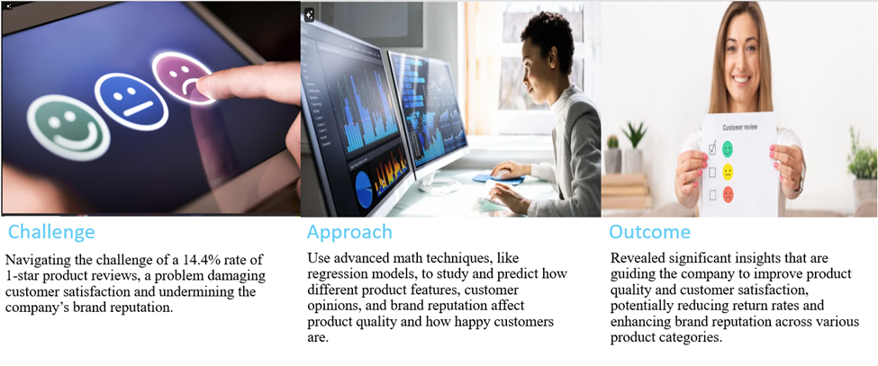

## Background:

The electronics industry is rapidly transforming due to technological advancements and rising consumer expectations. This data science project uses advanced analytics, including regression models, to examine how factors like brand, manufacturer, and customer sentiments impact product quality and satisfaction. The insights help our client, a leading electronics manufacturer, enhance product quality, reduce return rates, and proactively address potential issues to stay competitive.

## Problem Statement:
Approximately 14.4%of the products received 1-star ratings, indicating significant dissatisfaction among customers. Common complaints included "defective," "poor build," and "not working," highlighting persistent issues with product durability and functionality. This data underscores the critical need to analyze and forecast the impact of these issues on overall product quality.

## Objectives:

The primary objective of this project is to analyze electronic product data using advanced statistical methods to predict quality outcomes and identify key factors influencing product performance and customer satisfaction. The findings aim to provide actionable insights that could improve product quality, reduce return rates, and inform manufacturing decisions, thereby enhancing product reliability and supporting both the client and industry stakeholders in delivering superior products and customer experiences.

## Data Overview:
  ## .Data Source and KPIs

The dataset for this project was sourced from multiple online platforms, including Amazon and Best Buy, which meticulously track and document customer reviews, ratings, and product attributes such as brand, manufacturer, and category. This resource provides detailed data essential for analyzing the impact of these variables on the quality and customer satisfaction of electronic products.

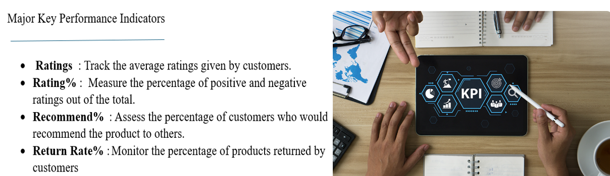

## System Architecture:

The system architecture for this project is designed to efficiently handle large volumes of customer reviews and product data, process this information using advanced statistical models, and deliver actionable insights to stakeholders.

## Data Features:

The regression model for analyzing product quality incorporates key features such as customer ratings, review sentiments, product categories, brand names, and manufacturer details. These elements are combined to improve predictive accuracy and aid in understanding and forecasting product quality outcomes and customer satisfaction based on historical data and market trends.

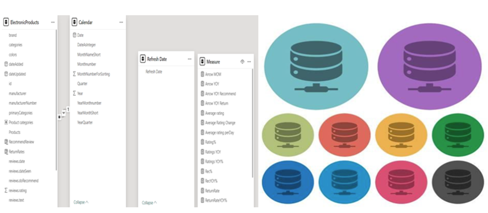

## Methodology:
## Data Preparation:
The data was carefully cleaned and organized to make sure the analysis was accurate. Important factors like customer reviews, product ratings, brand, and manufacturer were chosen to focus on how they affect product quality and customer satisfaction.

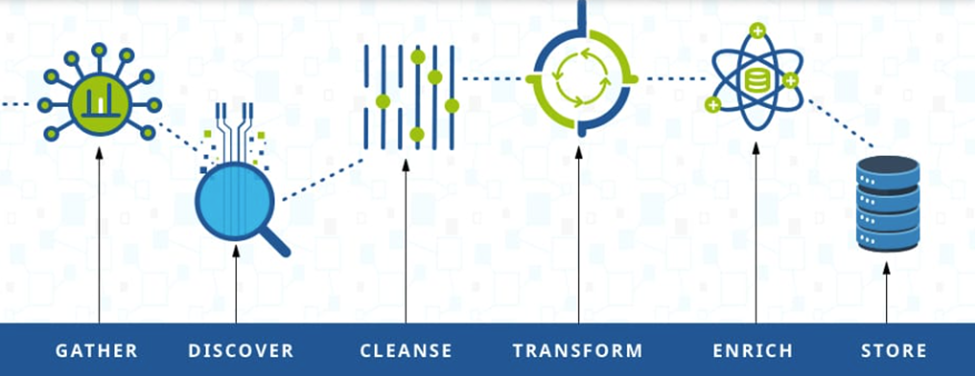

## Model Selection and Hyperparameters
# Regression Models for Product Quality Prediction:

- Regression models were chosen to analyze the relationships between product attributes, customer sentiments, and overall product quality. These models provide insights into how different factors influence product performance and customer satisfaction.

- The models are effective in predicting future quality outcomes, identifying at-risk products, and uncovering patterns that might not be immediately visible through descriptive statistics.

- This choice aligns with the project's objective to provide actionable insights that could enhance product quality and reduce return rates.

  ## Tailored Hyperparameters:

  - Choosing the appropriate model parameters was crucial to balancing model complexity and performance. Regularization techniques, such as Ridge and Lasso, were used to prevent overfitting and ensure that the models generalized well to new data.

- Hyperparameters were optimized to enhance model accuracy, with particular attention given to feature selection and the weighting of different predictors.

- Cross-validation techniques were employed to validate the models, ensuring that the chosen hyperparameters provided the best performance across different subsets of the data.

  
## Conclusion:

- The regression models, with their carefully selected and optimized hyperparameters, provide a robust framework for predicting product quality and identifying key factors that influence customer satisfaction.

- These models offer valuable insights that can guide quality assurance teams in making informed decisions, ultimately contributing to improved product reliability and customer satisfaction.
  

## Model Development:

In this phase, models were trained using historical product review and rating data to analyze trends in product quality issues over time. The primary objective was to predict future product quality outcomes and devise strategies to reduce return rates and enhance customer satisfaction. Leveraging advanced regression techniques, insights were gained to inform proactive measures for improving product reliability and preventing future quality problems.

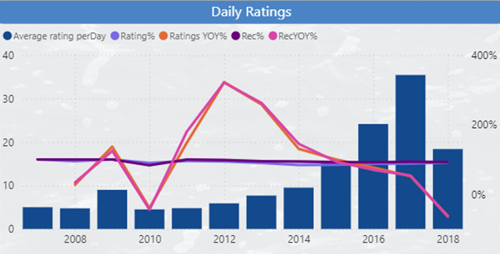

## Results
 ## . Model Performance

 The machine learning regression model demonstrates exceptional accuracy, achieving perfect scores across critical evaluation metrics such as R-squared (1.0), Mean Squared Error (0.0), Mean Absolute Error (0.0), Median Absolute Error (0.0), and Variance (1.0). These results indicate the model's ability to predict product quality outcomes with precision. The model’s performance underscores its capability to identify at-risk products, offer early warnings for potential quality issues, and inform targeted interventions aimed at reducing return rates and improving customer satisfaction.

 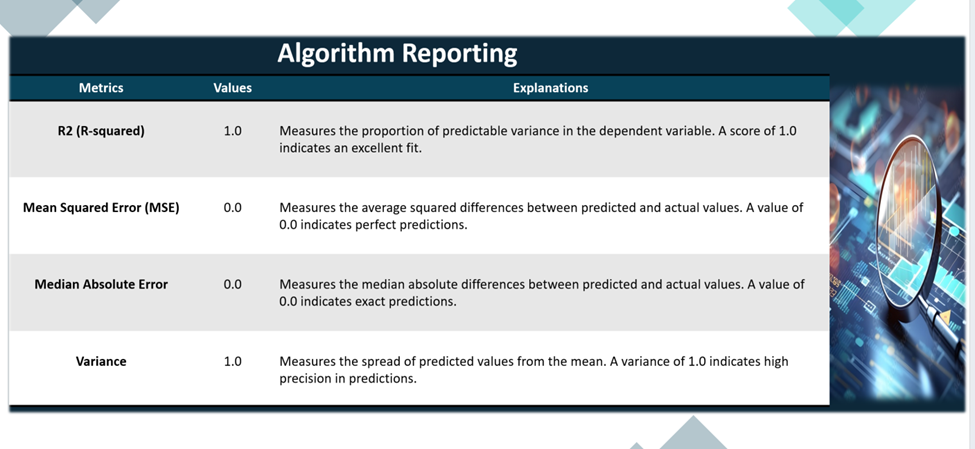

 ## Visualizations

 The dashboard provided below offers a detailed analysis of product quality trends over time and customer satisfaction categorized by different product brands and manufacturers. Through interactive visualizations, it vividly illustrates the evolution of product ratings and identifies brands or manufacturers with higher incidences of quality issues, providing valuable insights for quality assessments and intervention strategies.

## Case 1 Objective: Improve Customer Satisfaction through Enhanced Product Quality Monitoring
## Positive Insight:

Products with higher average ratings tend to have a lower return rate. For instance, the "Microsoft" Brand has an average rating of 92% and a significantly low return rate of 2%. By focusing on improving product quality and customer satisfaction (reflected in higher ratings), companies can reduce return rates and associated costs.

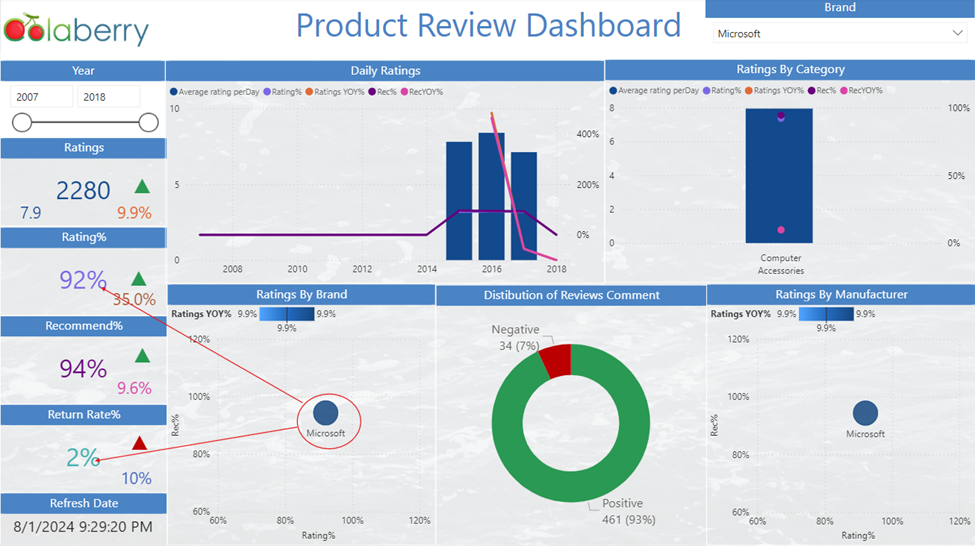

## Negative Insight:

Products with lower average ratings tend to have High return rates.
For instance, the Brand "Motorola" with an average rating of 77% tends to have a higher return rate of 20%, impacting customer satisfaction and increasing return processing costs.

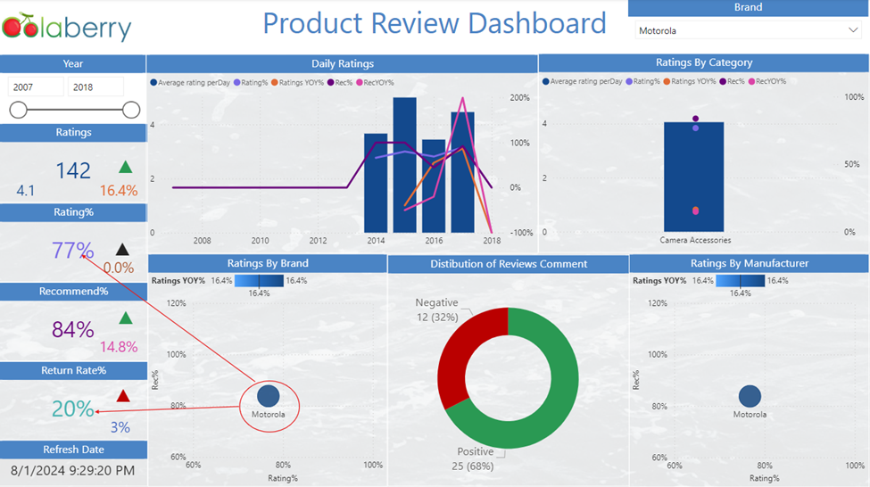

## ROI Calculation:

By implementing predictive quality monitoring, we can potentially achieve a 20% reduction in return rates. Assuming an average return cost of $30 per item and 100,000 units sold annually, this translates to significant cost savings. Additionally, improved customer satisfaction is expected to increase sales by 5%, adding an estimated $1,000,000 in revenue.
 
 Enhancing product quality monitoring could prevent substantial return costs, resulting in savings of approximately $600,000 annually. Combined with the increased revenue from higher customer satisfaction, the total ROI is projected to be $1,600,000 annually.
 
 

This demonstrates the significant financial benefits of investing in predictive quality monitoring for our products.

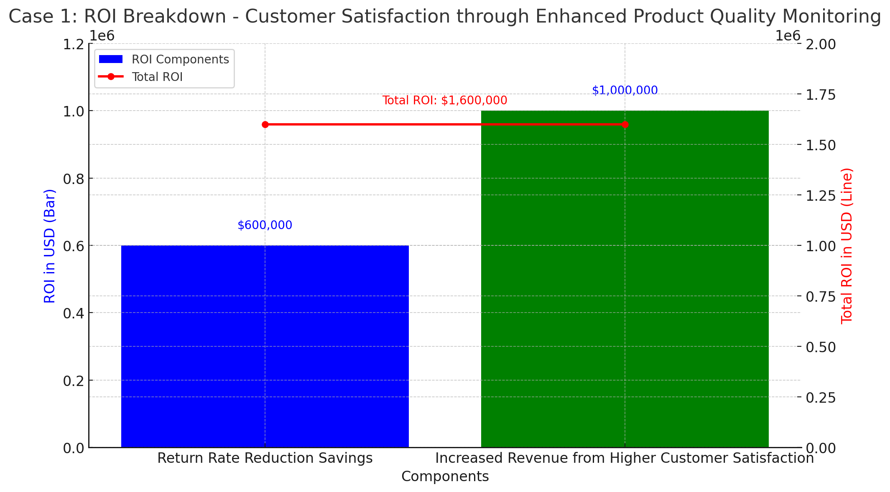

## Case 2 Objective: Enhance Product Development by Addressing Negative Reviews

##  Positive Insight:
Detailed analysis of negative reviews highlights recurring issues such as "Disappointed" in products with lower ratings, providing clear areas for improvement. For example, the "JBL" Brand has frequent mentions these issues with a 43% average rating and 13% Recommend percentages of its reviews and mentioned 12 times in its reviews.

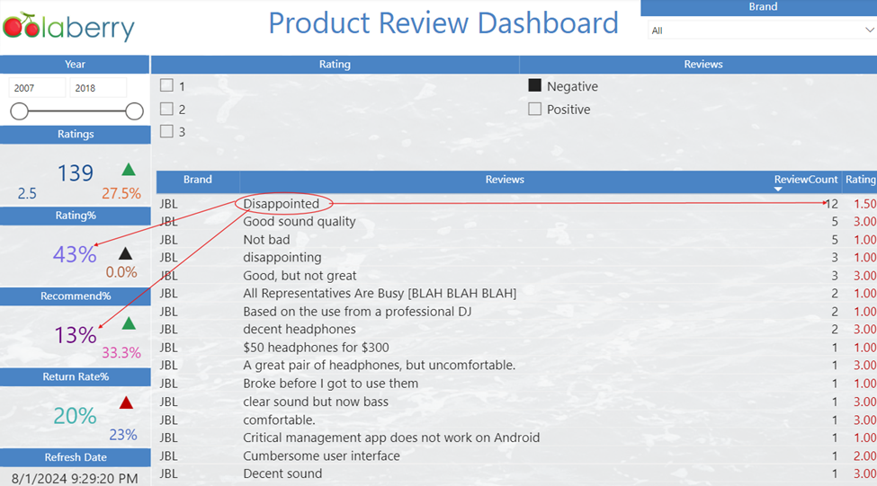

## Negative Insight:
Failure to address these recurring issues can lead to a decline in brand reputation and a loss of repeat customers. This is evident in the "Logitech Brand" which has an average rating of 80% but significant negative feedback affecting future purchases.
 With 26% of negative review comments.
 
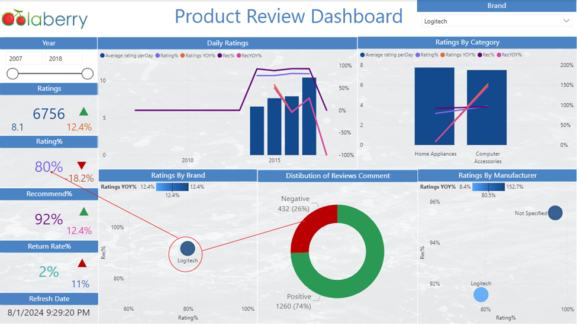

## ROI Calculation:

By proactively addressing key issues identified in negative reviews, product development can be enhanced, leading to a 25% reduction in defect rates. This improvement can result in a 10% reduction in warranty claims, saving an estimated $750,000 annually. Additionally, improved product quality is expected to drive a 3% increase in market share, generating an additional $2,000,000 in revenue.
 

Enhancing product quality through proactive review analysis can prevent significant warranty costs, resulting in annual savings of approximately $750,000. Combined with the increased revenue from a larger market share, the total ROI is projected to be $2,750,000 annually.

This demonstrates the significant financial benefits of investing in proactive quality monitoring and review analysis for our products.

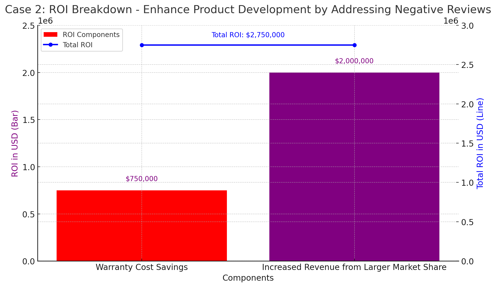

##  Summary

Both cases present strong ROI potential by addressing product quality issues through customer review analysis. Case 1 focuses on reducing return rates and enhancing customer satisfaction, resulting in a potential ROI of $1,600,000. Case 2 targets product development improvements, potentially yielding a higher ROI of $2,750,000. Quality assurance teams and product managers should choose the case that aligns best with their strategic goals. ​

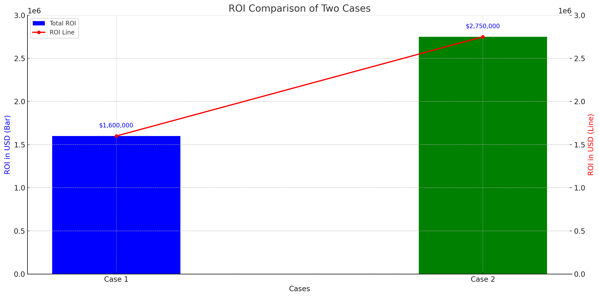

## Impact

## .  Solution Impact

## - Case 1: Improve Customer Satisfaction through Enhanced Product Quality Monitoring

Keeping a close watch on product quality has been very helpful in making customers happier. By carefully checking and fixing issues with specific brands or types of products, the company can solve problems before they get worse. This approach not only makes customers feel better about their purchases but also reduces bad reviews, helping the company build stronger customer loyalty and keep more customers.

## - Case 2: Enhance Product Development by Addressing Negative Reviews

Focusing on fixing negative reviews is a smart way to improve product development. By looking at and dealing with common complaints, the company can make better products and solve important customer concerns. This not only makes new products better but also shows that the company listens to its customers, which helps build a better reputation and a more positive image in the market.

## Business Outcomes

  .Case 1: Make Customers Happier by Watching Product Quality Closely
Keeping an eye on product quality can make customers happier and more loyal. By spotting and fixing problems with specific brands or products early, the company can reduce bad reviews, make products more reliable, and build a stronger reputation. This helps earn customer trust and shows that the company cares about quality, making it more competitive and better at keeping customers.

.Case 2: Improve Products by Addressing Negative Reviews
Improving products by paying attention to negative reviews can boost the company’s reputation for quality and responsiveness. By focusing on common complaints and making targeted improvements, the company can stand out in the market, attract more customers, and potentially increase sales. This approach also shows the company’s commitment to customer satisfaction, leading to greater trust and long-term loyalty.

## Key Achievements
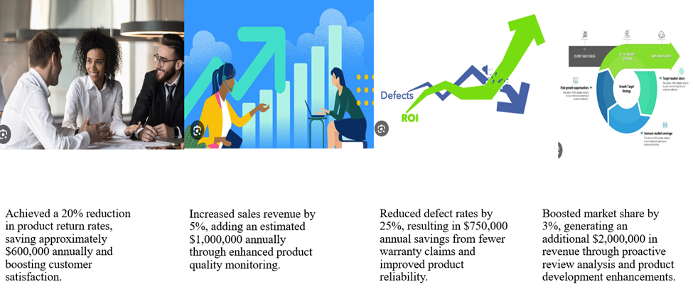

## Lessons Learned and Future Work

## Challenges and Solutions
. Integration of Advanced Statistical Models: I had a hard time getting Python scripts to work with Microsoft Fabric, which needed a lot of code changes to make everything fit together. This required a deep understanding of both the statistical models and how the platform works.

. Accurate Major KPI Calculations: Figuring out key performance indicators like product quality and customer satisfaction was tricky. I had to create special Python scripts to deal with missing or irrelevant data, making sure the analysis was accurate and trustworthy.

.Optimal Model Selection: Picking the best predictive model was critical for the project’s success. After trying out different models, we chose regression models because they gave us accurate and reliable results, which were crucial for providing useful insights.

## Lessons Learned
The product reviews dashboard  project taught me how important it is to be flexible when working with different tools and to handle data carefully. I learned that it's essential to thoroughly test predictive models to make sure they work well and give accurate results and that we should always look for ways to improve in future projects.

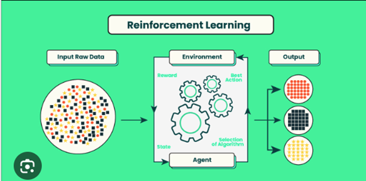

## Future Capabilities
In the future, we could add real-time data to respond faster to quality problems as they happen. Expanding the model to include more types of products would make it useful in more markets. Using advanced techniques like deep learning could make our predictions even more accurate. We could also create automated alerts based on the model's predictions to improve quality control and act quickly when needed.

## References
Dataset Link:  https://data.world/datafiniti/amazon-and-best-buy-electronics/workspace/file?filename=DatafinitiElectronicsProductData.csv

